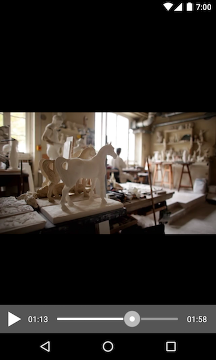

# SMASupportLibrary V1

Librairie support qui se base la lib-support-v7 de Google.  
Elle intègre un ViewPager et un TabLayout.  
    
    :::javascript
    compile 'com.android.support:appcompat-v7:24.+'
    compile 'com.android.support:design:24.+'
    compile 'com.android.support:support-v13:24.+'

# Import

    :::javascript
    // project gradle
    allprojects {
        repositories {
            jcenter()
            maven { url 'https://dl.bintray.com/smartapps/maven' }
        }
    }
    
    // module gradle
    compile 'fr.smartapps.library:lib_sma-support-v1:1.0.6'

# Implement

## SMATab

 
    
    :::java
    SMATabLayout tabLayout = (SMATabLayout) findViewById(R.id.tab);
    tabLayout.titles("Tab 1", "Tab 2", "Tab 3")    
        .icons(iconList)   
        .stateListColorTitle(titleColorStateList)   
        .typeFace(typeface)
        .textSize(size)
        .create(SMATabMode.VERTICAL); 

This is the maximum implementation for a tabLayout :  

- titles() provide a list of titles for each tab
- icons() provide a list of icons for each tab 
- stateListColorTitle() provide StateListColor for different color if tab is selected or not
- typeFace() custom typeFace for titles
- textSize() custom size for titles in SP
- create() always finish by create() you must set if title and icon are indent HORIZONTALLY or VERTICALLY

If you only have icons or titles, only use titles() or icons().

## SMAViewPager

 
 

    :::java
    pager = (SMAViewPager) findViewById(R.id.pager);
    pager.fragmentManager(getFragmentManager())
        .setFragments(new Fragment1(), new Fragment2(), new Fragment3())
        .transformer(Transition.ACCORDION);
        .create();

This is a common use case of SMAViewPager :

- fragmentManager() always call this method to get manager of fragments
- setFragments() provide a list of fragments
- transformer() if you want a common Pager this method is optionnal (cf. bonus at the end)
- create() always finish with this method

transformer() method can be called afterward to change pager animation dynamically.

## SMAViewPager & SMATab

    :::java
    tabLayout.titles(titleList)
                .viewPager(pager)
                .icons(iconList)
                .stateListColorTitle(colorStateList)
                .create(SMATabMode.VERTICAL);

Only call the method "viewPager()" to make SMAViewPager & SMATab work together

## Bonus

You can block the SWIPE of the SMAViewPager with the following method :

    pager.swipeable(false);

And make it work again with :

    pager.swipeable(true);

SMAViewPager has many more Transition :  
ACCORDION,  
BACK_TO_FRONT,  
CUBE_DOWN,  
CUBE_OUT,  
DEPTH_PAGE,  
FLIP_HORIZONTAL,  
FLIP_VERTICAL,  
FRONT_TO_BACK,  
PARALLAX_PAGE,  
ROTATE_DOWN,  
ROTATE_UP,  
STACK,  
TABLET,  
ZOOM_IN,  
ZOOM_OUT_SIDE,  
ZOOM_OUT

# SMAZoomableImageView

## Import

    :::javascript
    // project gradle
    allprojects {
        repositories {
            jcenter()
            maven { url 'https://dl.bintray.com/smartapps/maven' }
        }
    }

    // module gradle
    compile 'fr.smartapps.library:lib_smazoomableimageview:1.0.0'

## Implement

    :::java
    SMAZoomableImageView zoomableImageView = (SMAZoomableImageView) findViewById(R.id.zoomable_image_view);
    zoomableImageView.setImageDrawable(drawable);
    zoomableImageView.setMaxZoom(10); // zoom multiplier

Add to your layout

    :::xml
    <fr.smartapps.lib_smazoomableimageview.SMAZoomableImageView
        android:id="@+id/zoomable_image_view"
        android:layout_width="match_parent"
        android:layout_height="match_parent" />

# SMADialog

Instantiate easily a custom dialog box.
Project in progress.

## Import

    :::javascript
    // project gradle
    allprojects {
        repositories {
            jcenter()
            maven { url 'https://dl.bintray.com/smartapps/maven' }
        }
    }

    // module gradle
    compile 'fr.smartapps.library:lib_smadialog:1.0.4'

## Implement

    :::java
    new SMADialog(this)
        .cancelableOnTouchOutside(true)
        .setCustomlayout(R.layout.dialog, new SMADialogListener() {
            @Override
            public void onCreate(final Dialog dialog) {
                [...]
            }
        })
    .show();

In the onCreate() callback, set your dialog view :

    :::java
    public void onCreate(final Dialog dialog) {
        // textview
        TextView titleView = (TextView) dialog.findViewById(R.id.titleView);
        titleView.setText("Lorem ipsum");

        // button
        Button buttonOk = (Button) dialog.findViewById(R.id.button_ok);
        buttonOk.setOnClickListener(new View.OnClickListener() {
            @Override
            public void onClick(View view) {
                dialog.cancel();
            }
        });
    }

# SMAMapView

## Import

    :::javascript
    // project gradle
    allprojects {
        repositories {
            jcenter()
            maven { url 'https://dl.bintray.com/smartapps/maven' }
        }
    }

    // module gradle
    compile 'fr.smartapps.library:lib_smamapview:1.0.4'

## Implement

## Init map

    :::java
    mapView = (SMAMapView) findViewById(R.id.map);
    mapView.init(mapWidth, mapHeight,
        new BitmapProviderListener() {
            @Override
            public Drawable getDrawable(String formattedTileName, Context context) {
                // return drawable from formattedTileName string
                return assetManager.getDrawable(formattedTileName);
            }
        },
        new MapCalloutClickListener() {
            @Override
            public void onCalloutClick(int pinIdx) {
                // callback when you click on the pin popup (callout)
            }

            @Override
            public Drawable getCalloutDisclosureDrawable() {
                // you can add an arrow drawable to customize the pin popup (callout)
                return null;
            }
        }
    );

    mapView.addDetailLevels("media56551", ".jpg"); // cf. naming strategy at the end
    mapView.setScaleLimits(0, 3); // from 0 to 3 times zoom
    mapView.defineBounds(0, 0, 1, 1); // useful to positioned user pin & POI pins
    // mapView.setMinimumScaleMode(ZoomPanLayout.MinimumScaleMode.FILL); // minimum zoom fill the view
    // mapView.setMinimumScaleMode(ZoomPanLayout.MinimumScaleMode.FIT); // minimum zoom fit the view
    // mapView.setScale(0); // default : init scale at zoom 0
    // mapView.setTilesSize(1024); // default : tile size are set at 1024px

## Add user pin

    :::java
    mapView.setPinUser(positionX, positionY, assetManager.getDrawable("pin_user.png").density(5));
    // positionX, positionY : X and Y position relative to defineBounds() in init
    // pin drawable : assetManager.getDrawable("pin_user.png").density(5)

    mapView.setPinUserRotation(float angle);
    // set pin user rotation angle from 0 to 360

## Add POI pins

    :::java
    mapView.addPin(positionX, positionY, assetManager.getDrawable("map_pin.png").density(5), "pin 1", 1);
    // positionX, positionY : X and Y position relative to defineBounds() in init
    // pin drawable : assetManager.getDrawable("pin_user.png").density(5)
    // "pin 1" : message display in callout
    // 1 : pinIdx you will receive onCalloutClick() callback

## Specificities

Naming strategy for tiles (cf. demo app) :

Dependencies :

    :::xml
    compile 'com.qozix:tileview:2.1.2'

# SMAVideoView

## Import

    :::javascript
    // project gradle
    allprojects {
        repositories {
            jcenter()
            maven { url 'https://dl.bintray.com/smartapps/maven' }
        }
    }

    // module gradle
    compile 'fr.smartapps.library:lib_smavideoview:1.0.5'

## Implement

## Simple init
    :::java
    smaVideoView = (SMAVideoView) findViewById(R.id.smavideoview);
    smaVideoView.create("video.mp4");
    // force width & height
    smaVideoView.create("video.mp4", 840, 480);

The function create() could have a **string** : load from assets or an **AssetFileDescriptor**

## Custom init

    :::java
    smaVideoView
                // drawable
                .thumbDrawable(getDrawable("thumb.png"))
                .playDrawable(getDrawable("play.png"))
                .pauseDrawable(getDrawable("pause.png"))

                // scalable : default value is FIT_CENTER
                .setScalableType(ScalableType scalableType)

                // custom colors
                .setVideoBackgroundColor(Color.parseColor("#000000"))
                .setPlayerBackgroundColor("#555555")
                .setThumbColor("#abcdef")
                .setProgressFinishedColor("#abcdef")
                .setProgressUnfinishedColor("#abcdef")
                .setTimeColor("#abcdef")
                .setPlayPauseBtnColor("#abcdef")

                // default: 0: the player will be hidden after 5 seconds
                // 1: player will be always visible
                // 2: player will be always hidden
                .setPlayerVisibility(0)

                // defines how many time the player is visible
                .setVisibleTime(millisecond)

                // true : video start at create / default false : video not playing at start
                autoPlay(boolean);

These color functions could have a **Color (int)** or a **String ("#ff0000")**

## Common method

    :::java
    smaVideoView.isPlaying();               // return true or false if video is palying
    smaVideoView.play();                    // start video
    smaVideoView.pause();                   // pause video
    smaVideoView.setProgress(int time);     // set video time at "time" milliseconds
    smaVideoView.getCurrentTime();          // return current video "time"
    smaVideoView.setProgressVisible(true);   // Active method : show or hide player

## Subtitles

The SMAVideoView supports internal subtitles tracks in MP4 files. To set the locale you want to display, just call the **setLocale** method.
  
    :::java
    // Define the subtitles locale
    smaVideoView.setLocale("en").create("video.mp4", 840, 840);
    
You can force the player to display the selected subtitle track by calling the **subtitlesForced** method. (This method hide the subtitles toggle button)

    :::java
    // Force the selected subtitle track and disable the toggle button
    smaVideoView.setLocale("en").subtitlesForced(true).create("video.mp4",840,840); 
    
### Supported subtitles locales

The SMAVideoView support the locales listed in the following table. To each SMAVideoView locale is associated a locale that is defined in the video file subtitle track meta datas.

Example: To display **english** subtitles, you must call the **setLocale** method with **en** as parameter and the subtitles track locale must be **eng**.

|Language|Video subtitle track locale|SMAVideoView locale|
|---|---|---|
|English|eng|en|
|German|deu|de|
|French|fra|fr|
|Japanese|jpn|ja|
|Chinese|zho|zh|
|Arabic|ara|ar|
|Korean|kor|ko|
|Hindi|hin|hi|
|Catalan|cat|ca|
|Dutch|nld|nl|
|Spanish|spa|es|
|Hebrew|heb|he|
|Swedish (Svenska)|swe|sv|
|Portuguese|por|pt|
|Italian|ita|it|
|Breton|bre|br|
    

# SMAListView

# Import

    :::javascript
    // project gradle
    allprojects {
        repositories {
            jcenter()
            maven { url 'https://dl.bintray.com/smartapps/maven' }
        }
    }

    // module gradle
    compile 'fr.smartapps.library:lib_smalistview:1.0.0'

# Implement

## Add to layout

    :::xml
    <fr.smartapps.smalistview.SMAListView
        android:id="@+id/list"
        android:orientation="horizontal"
        android:layout_width="match_parent"
        android:layout_height="wrap_content"/>

## Initialize in your activity

**numberOfColumn** : indicate the number of column in your list

    :::java
    listView.initData(numberOfColumn, getDataViews(), new SMAListListener() {
        @Override
        public void onBindViewHolder(View itemView, SMADataView dataView) {
            [ ... next step ... ]
        }
    });

## getDataViews() : populate your list with this method

    :::java
    protected List<SMADataView> getDataViews() {
        List<SMADataView> result = new ArrayList<>();

        // create your data
        SMADataView dataView = new SMADataView(R.layout.layout_cell);

        // set conveniant & usual attributes
        dataView.setId(1);
        dataView.setTitle("Title");
        dataView.setSubtitle("Subtitle");
        dataView.setImage("image.png");
        [ ... ]

        // set generic attributes
        dataView.setString("key_1", "random string");
        dataView.setBoolean("key_2", false);
        dataView.setInt("key_3", 10);
        [ ... ]

        // set any attributes
        dataView.set("key", Object);
        [ ... ]

        // populate your list with data
        result.add(dataView);
        result.add(dataView);
        result.add(dataView);
        [ ... ]

        // finish by returning your list of data
        return result;
    }

## Implement SMAListListener() : callback when the view is binded (when the view appears on screen)

    :::java
    @Override
    public void onBindViewHolder(View itemView, SMADataView dataView) {
        // set title
        TextView titleView = (TextView) itemView.findViewById(R.id.row_title);
        if (titleView != null) {
            titleView.setText(dataView.getTitle());
        }

        // set image
        ImageView imageView = (ImageView) itemView.findViewById(R.id.row_image);
        if (imageView != null) {
            imageView.setImageDrawable(getDrawable(dataView.getImage()));
        }

        [ ... ]

        // also check usual methods :
        // dataView.getString("key_1");
        // dataView.getBoolean("key_2");
        // dataView.getInt("key_3");
        // [ ... ]

        // check the most powerful
        // dataView.get("key");
        // [ ... ]
    }

## For more power, check the sample !

## TODO

- Bugfix :
reloadDatas() => onCreateViewHolder() n'est pas appelé et le resourceLayout n'est donc pas actualisé
reloadData() ne peut que actualiser le contenu et pas le layout de la cellule.
=> Cf. notifyDataSetChanged()
=> Voir notifyDataIyemInserted() / removed()
voir http://stackoverflow.com/questions/28709220/understanding-recyclerview-sethasfixedsize?answertab=active#tab-top

- SearchActivity result ordered by letter + total number of results at top cell (cf. 1password search activity)

- SearchViewFormatter with drawable (cf.Correntin) Demo

- Add collapsible listeview :
https://bignerdranch.github.io/expandable-recycler-view/
http://stackoverflow.com/questions/27203817/recyclerview-expand-collapse-items?answertab=active#tab-top

- Set separator height and color